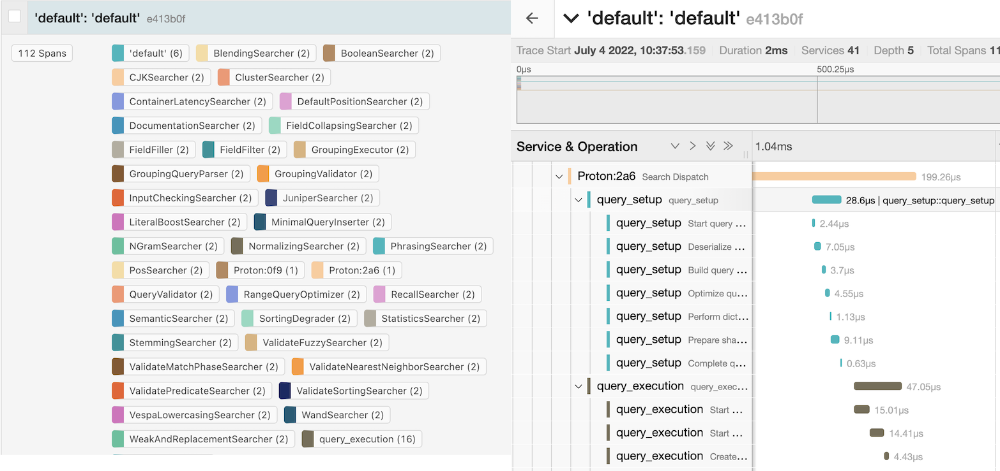

<!-- Copyright Yahoo. Licensed under the terms of the Apache 2.0 license. See LICENSE in the project root. -->

# Vespa client

This app is work in progress.

This client currently contains the **Query Builder** and the **Trace Visualizer**.

# Query Builder

The Query Builder is a tool for creating Vespa queries to send to a local backend.  
The tool provides all of the options for query parameters from dropdowns. The input fields  
provide hints to what is the expected type of value.

# Trace Visualizer

The Trace Visualizer is a tool for converting and visualizing traces from Vespa in a flame graph.  
To use the visualizer, a [Jaeger](https://www.jaegertracing.io/) instance must be run locally with Docker.

    docker run -d --rm \
    -p 16685:16685 \
    -p 16686:16686 \
    -p 16687:16687 \
    -e SPAN_STORAGE_TYPE=memory \
    jaegertracing/jaeger-query:latest

To use the visualizer you paste the Vespa trace into the text box and press the button to convert the trace  
to a format supported by Jaeger and download it.  
Only Vespa traces using _trace.timestampa=true_ **and** _traceLevel_ between 3 and 5 (inclusive) will work correctly.

When downloading the trace a new tab with Jeager will open up.  
Press the _JSON File_ button as shown in the image, and drag and drop the trace you just downloaded.

You can then click on the newly added trace and see it displayed as a flame graph.

# Client install and start

    nvm install --lts node  # in case your current node.js is too old
    yarn install
    yarn dev                # then open link, like http://127.0.0.1:3000/
